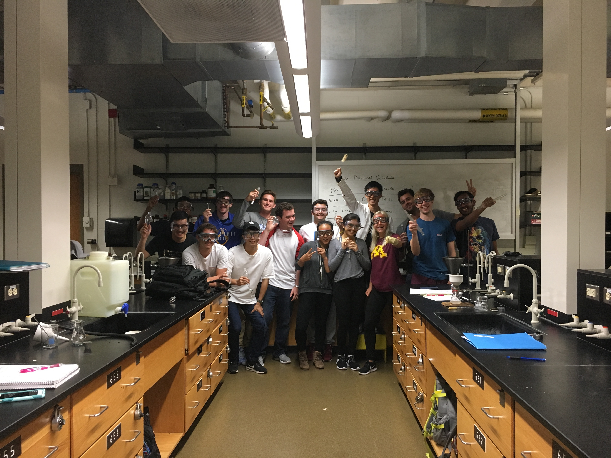

As a teaching assistant, I instruct groups of 18 students for 4-hour lab sessions. In a total of 6 semesters of teaching, I have worked with more than 100 students. My major responsibilities include instructing students on organic experiments procedures and techniques, giving mini-lectures during lab session to review key informations and knowledges, grading students' homework and lab reports, and holding office hours for course-related questions.  
<!--  -->
